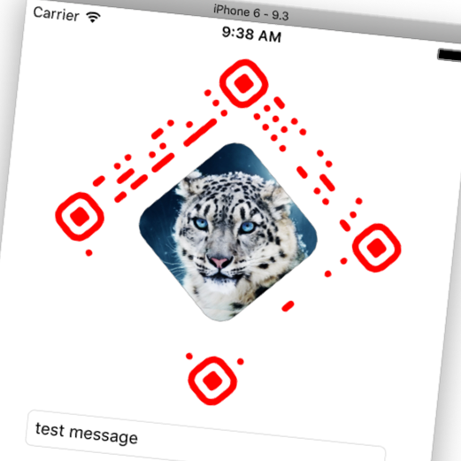
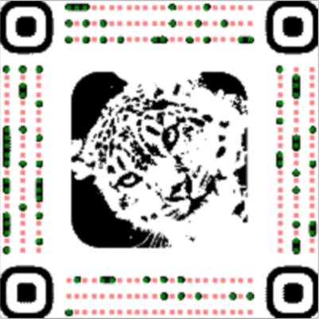

# QRCodes
Example how to build you own QR codes (like Facebook do, but much better)

  ----->  -> "test message"

On iPhone 6 works ~40 fps.

Presentation: [video](https://youtu.be/77TUO-IZmco), [slides](https://docs.google.com/presentation/d/1DnQUiRQfWjpuvgDIHeuLvMCu8T2i7dvCLLhA81MNGKw/edit?usp=sharing)
